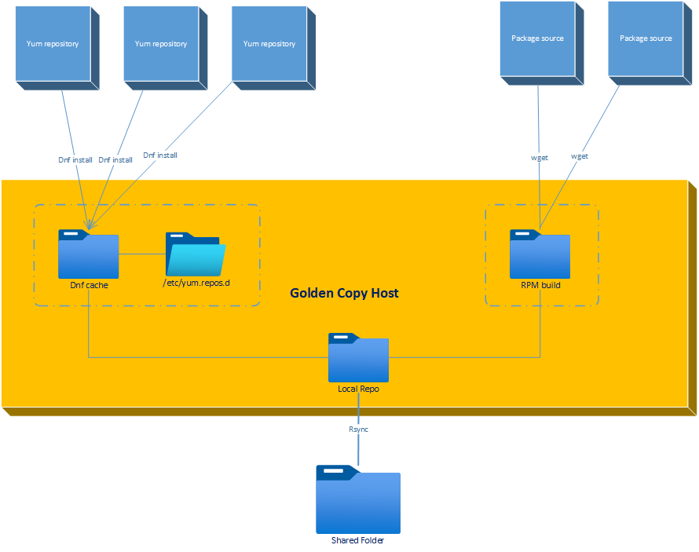

# Repo Handler Script

**Developed by**: Dániel Némethy (nemethy@moderato.hu) with AI support (Claude Sonnet, ChatGPT-4)

## Overview

The `repo-handler` project provides a bash script designed to manage, clean, and synchronize local package repositories on systems that are isolated from the Internet. This script is particularly useful for environments where a local mirror of installed packages needs to be maintained and synchronized with a shared repository.

### Repository Architecture

The script manages a **LOCAL_REPO_PATH** (typically `/repo`) that contains two types of repositories:

1. **Internet-sourced repositories**: These contain a reduced subset of official internet repositories, including only the packages that are actually installed on the local "golden copy" system. This creates much smaller repositories compared to the original internet repositories.

2. **Manual repositories** (defined in `MANUAL_REPOS`): These are additional repositories (like `ol9_edge`) that will be replicated and synchronized regardless of whether their content is installed locally. These allow for manual package deployment and custom repository management.

The script helps:

- **Replicate and Update**: Creates and updates internet-sourced repositories based on installed packages from a "golden copy" system, plus manages manual repositories regardless of installation status.
- **Automatic Cleanup**: Removes uninstalled or outdated packages from internet-sourced repositories, ensuring they only contain necessary packages.
- **Manual Repository Support**: Maintains and synchronizes manual repositories (like `ol9_edge`) that can contain packages not necessarily installed locally.
- **Synchronization**: Keeps both types of repositories in sync with a shared repository using `rsync`.
- **Configuration Flexibility**: Allows customization through a configuration file `myrepo.cfg` and command-line arguments.
- **Repository Exclusions**: Enables exclusion of certain repositories from being processed.



### Key Features:

- **Reduced Repository Size**: The internet-sourced repositories are much smaller than the original upstream repositories, containing only packages installed on the specific environment, while manual repositories provide flexibility for additional package deployment.
- **Batch Processing**: Efficiently processes packages in batches for performance optimization.
- **Automatic Cleanup**: Removes older or uninstalled package versions from the local repository.
- **Synchronization**: Keeps the local repository in sync with a shared repository using `rsync`.
- **Flexible Filtering**: Supports both repository-level and package name-level filtering for precise control over what gets processed.
- **Customizable Output**: Aligns repository names in output messages for better readability.
- **Configuration File Support**: Introduces `myrepo.cfg` for overriding default settings, with command-line arguments taking precedence.
- **Debugging Options**: Includes a `DEBUG_LEVEL` for controlling output verbosity during script execution.
- **Debug Level Control**: Allows setting the verbosity of log messages using the `DEBUG_LEVEL` option (0=ERROR, 1=WARN, 2=INFO, 3=DEBUG, 4=TRACE).
- **Error Handling Flexibility**: Provides configurable behavior to either halt immediately on critical download errors or continue running despite them (CONTINUE_ON_ERROR setting). 
- **Repository Exclusions**: Allows excluding repositories that should not be included in the local/shared mirror.

## Architecture Overview

The script manages a repository structure within **LOCAL_REPO_PATH** (typically `/repo`) that contains:

### 1. **Internet-sourced repositories** 
These are automatically managed repositories that mirror official internet repositories, but contain only packages that are installed on the local "golden copy" system. This dramatically reduces repository size compared to full upstream mirrors.

### 2. **Manual repositories** (MANUAL_REPOS)
These are additional repositories (e.g., `ol9_edge`) that:
- Are replicated and synchronized regardless of local installation status
- Allow for manual package deployment and custom repository management  
- Enable air-gapped environments to maintain custom package collections
- Can be manually populated with RPMs outside the script's automatic processing

**Key concepts:**
- **LOCAL_REPO_PATH**: Base directory (`/repo`) containing the complete repository tree structure
- **MANUAL_REPOS**: Specific repository names within LOCAL_REPO_PATH that receive special manual management treatment

## Requirements

Before running `myrepo.sh`, ensure the following requirements are met:

### System Requirements

- **Linux Distribution**: Red Hat-based distributions (RHEL, CentOS, Oracle Linux, etc.)
- **Package Manager**: DNF (Dandified YUM)
- **Tools**: `createrepo_c`, `rsync`, `bash` (version 4.0+)

### User Permissions

**Default Mode (USER_MODE=0 - Recommended):**
- **Sudo Access Required**: The user must have sudo privileges to run DNF operations and access repository directories
- The script will automatically use `sudo` when needed for operations like:
  - Running DNF commands (`dnf download`, `dnf list`, etc.)
  - Creating and updating repository metadata (`createrepo_c`)
  - Writing to system directories

**User Mode (USER_MODE=1 - Advanced):**
- **Direct Write Access Required**: The user must have direct write access to all repository paths
- No sudo is used, but all directories must be owned/writable by the current user
- Requires manual permission setup (see [Setting Up Permissions](#setting-up-permissions))

### Installation of Required Tools

```bash
# Install required packages (requires sudo)
sudo dnf install createrepo_c rsync dnf-utils
```

**Important**: If you don't have sudo access on your system, you cannot run this script in the default mode. Either:
1. Obtain sudo privileges, or
2. Use `--user-mode` and manually configure all directory permissions

## Configuration

### Using `myrepo.cfg`

The `myrepo.cfg` file provides a convenient way to configure `myrepo.sh` without modifying the script itself. All default configuration options are listed in the file, commented out. To customize the script:

1. **Open `myrepo.cfg`**:

   ```bash
   nano myrepo.cfg
   ```

2. **Uncomment and Modify Desired Options**:

   For example, to change the `DEBUG_LEVEL` to `3`:

   ```bash
   # Set debug level (0=ERROR, 1=WARN, 2=INFO, 3=DEBUG, 4=TRACE)
   DEBUG_LEVEL=3
   ```

3. **Save and Close the File**.

### Configuration Options

```bash
# myrepo.cfg - Configuration file for myrepo.sh
# The default values are given below, commented out.
# To configure, uncomment the desired lines and change the values.

# Set the local repository path (base directory containing the repository tree)
# LOCAL_REPO_PATH="/repo"

# Set the shared repository path
# SHARED_REPO_PATH="/mnt/hgfs/ForVMware/ol9_repos"

# Define manual repositories (individual repos within LOCAL_REPO_PATH, comma-separated)
# MANUAL_REPOS="ol9_edge"

# Set the RPM build path
# RPMBUILD_PATH="/home/nemethy/rpmbuild/RPMS"

# Set debug level (0=ERROR, 1=WARN, 2=INFO, 3=DEBUG, 4=TRACE)
# DEBUG_LEVEL=2

# Set maximum number of packages to process (0 = no limit)
# MAX_PACKAGES=0

# Set batch size for processing
# BATCH_SIZE=50

# Set the number of parallel processes
# PARALLEL=6

# Enable dry run (1 = true, 0 = false)
# DRY_RUN=0

# Continue execution despite download errors (0 = halt on errors, 1 = continue despite errors)
# CONTINUE_ON_ERROR=0

# Run under the non-root user environment (1 = true, 0 = false)
# IS_USER_MODE=0

# Define repositories that should be excluded from processing
# Any packages from these repositories will not be mirrored or added to LOCAL_REPO_PATH
EXCLUDED_REPOS="copr:copr.fedorainfracloud.org:wezfurlong:wezterm-nightly"

# Filter packages by name using regex pattern (empty = process all packages)
# NAME_FILTER=""

# Filter repositories to process (comma-separated list, empty = process all enabled)
# FILTER_REPOS=""

# Re‑scan everything on the next run (1 = true, 0 = false).
# When set to 1 the processed‑package cache is cleared at start‑up.
# FULL_REBUILD=0

# Group consecutive EXISTS package outputs by repository (1 = enabled, 0 = disabled)
# Default is enabled (1). Set to 0 to show individual package messages instead.
# GROUP_OUTPUT=1

# Manual Repository Management Settings
# AUTO_UPDATE_MANUAL_REPOS=1          # Enable automatic detection of manual repo changes
# LOCAL_REPO_CHECK_METHOD=FAST       # Detection method: FAST (timestamp) or ACCURATE (content)

# Adaptive Performance Tuning Settings
# ADAPTIVE_TUNING=1                  # Enable adaptive batch size and parallelism tuning
# MIN_BATCH_SIZE=20                  # Minimum batch size for adaptive tuning
# MAX_BATCH_SIZE=100                 # Maximum batch size for adaptive tuning
# MIN_PARALLEL=1                     # Minimum parallel processes
# MAX_PARALLEL=8                     # Maximum parallel processes
# PERFORMANCE_SAMPLE_SIZE=5          # Performance samples before adjustments
# TUNE_INTERVAL=3                    # Batches between tuning attempts
# EFFICIENCY_THRESHOLD=60            # Efficiency % threshold for optimization

# Repository metadata compression type (default: zstd)
# REPO_COMPRESS_TYPE=zstd

# Number of parallel repoquery jobs for metadata fetching (default: 4)
# REPOQUERY_PARALLEL=4
```

### Log Level Control

The `DEBUG_LEVEL` option allows you to control the verbosity of log messages. Available levels are:

- `0` (ERROR): Logs only critical errors.
- `1` (WARN): Logs warnings and errors.
- `2` (INFO): Logs informational messages, warnings, and errors (default).
- `3` (DEBUG): Logs detailed debugging information, along with all other levels.
- `4` (TRACE): Logs very detailed trace information for troubleshooting.

To set the debug level, modify the `DEBUG_LEVEL` option in `myrepo.cfg`:

```bash
# Set debug level (0=ERROR, 1=WARN, 2=INFO, 3=DEBUG, 4=TRACE)
DEBUG_LEVEL=3
```

You can also set it via command line using `--debug LEVEL`.

### Repository Exclusion Feature

Some repositories may contain packages installed on the golden-copy machine but are **not intended to be mirrored**. The `EXCLUDED_REPOS` setting ensures that these repositories are:

1. **Skipped during processing** (packages from these repositories will not be added to the local repo).
2. **Removed from the local repository path if already present**.

This feature is useful for temporary or special-purpose repositories, such as **Copr repositories**.

### Package Name Filtering Feature

The `--name-filter` option allows you to process only specific packages based on their name patterns, making the script more efficient for targeted operations. This feature applies regex pattern matching to package names during the installed package fetching phase.

#### Use Cases:

- **Testing**: Process only specific packages to test repository functionality
- **Selective Mirroring**: Mirror only packages matching certain naming patterns (e.g., all `nodejs*` packages)
- **Debugging**: Isolate specific packages for troubleshooting
- **Performance**: Reduce processing time when only certain packages are needed

#### Examples:

```bash
# Process only Firefox packages
./myrepo.sh --name-filter "firefox"

# Process all NodeJS-related packages
./myrepo.sh --name-filter "nodejs"

# Process packages starting with "lib" (using regex)
./myrepo.sh --name-filter "^lib"

# Combine with repository filtering for precise control
./myrepo.sh --repos ol9_appstream --name-filter "firefox|chrome"
```

#### Configuration File Support:

You can also set the name filter in `myrepo.cfg`:

```bash
# Filter packages by name using regex pattern
NAME_FILTER="firefox"
```

#### Important Notes:

- **Regex Support**: The pattern supports extended regular expressions (ERE)
- **Efficient Processing**: Filtering is applied at the DNF query level, not after fetching all packages
- **Graceful Handling**: If no packages match the filter, the script continues normally without errors
- **Case Sensitive**: Pattern matching is case-sensitive by default
- **Combines with Repository Filtering**: Works together with `--repos` for fine-grained control

### Manual Repository Management (Manual Change Detection)

Version 2.3.0+ introduces advanced manual repository management that can automatically detect and handle manual changes to individual manual repositories within the repository tree. This is particularly useful in environments where RPM packages are manually copied to specific repositories (like `ol9_edge`) outside of the script's normal processing workflow.

#### Key Features:

- **Dual-Tier Metadata Strategy**: Regular repositories only update metadata when packages are processed, while manual repositories (e.g., `ol9_edge`) can detect manual changes even when no packages are processed during the current run.
- **Configurable Detection Methods**: Choose between FAST (timestamp-based) and ACCURATE (content-based) detection methods.
- **Automatic Updates**: Manual repositories are automatically checked for manual changes and metadata is updated accordingly.
- **Sync-Only Mode Optimization**: Metadata updates are intelligently skipped during `--sync-only` mode for better performance.

#### Configuration Options:

```bash
# Enable automatic detection and update of manual repository changes (1 = enabled, 0 = disabled)
# When enabled, the script will check manual repositories for manual changes even if no packages
# were processed during the current run. Useful for repositories where RPMs are manually copied.
AUTO_UPDATE_MANUAL_REPOS=1

# Manual repository metadata check method (FAST or ACCURATE)
# FAST: Uses timestamp comparison between RPM files and metadata (faster, good for most cases)
# ACCURATE: Uses content comparison to detect count mismatches (more thorough but slower)
# Default is FAST for optimal performance while still catching most manual changes.
LOCAL_REPO_CHECK_METHOD=FAST
```

#### How It Works:

1. **FAST Method**: Compares the newest RPM file timestamp against the repository metadata timestamp. If RPMs are newer, metadata is updated.
2. **ACCURATE Method**: Counts actual RPM files and compares with the metadata package count. If counts differ, metadata is updated.

#### Use Cases:

- **Manual Package Deployment**: When administrators manually copy RPM files to specific manual repositories (like `ol9_edge`)
- **Airgapped Environments**: Where packages are transferred via external media and manually placed
- **Mixed Workflows**: Environments where both automated and manual package management occur
- **Development Environments**: Where local builds are frequently copied to test repositories

#### Example Configuration:

```bash
# myrepo.cfg - Enable accurate detection for critical repositories
AUTO_UPDATE_MANUAL_REPOS=1
LOCAL_REPO_CHECK_METHOD=ACCURATE
MANUAL_REPOS="ol9_edge,custom_apps,local_builds"
```

This ensures that manually added packages are properly indexed and available through the repository metadata without requiring a full rebuild.

### Adaptive Performance Tuning

The script includes an intelligent adaptive performance tuning system that automatically optimizes `BATCH_SIZE` and `PARALLEL` settings based on real-time performance metrics. This helps achieve optimal throughput across different system configurations and network conditions.

#### Key Features:

- **Dynamic Optimization**: Automatically adjusts batch size and parallelism based on performance measurements
- **Efficiency Monitoring**: Tracks processing efficiency and makes adjustments when performance drops
- **Configurable Bounds**: Set minimum and maximum limits for batch size and parallel processes
- **Sample-Based Analysis**: Uses multiple performance samples for stable optimization decisions
- **Non-Disruptive**: Adjustments are made gradually without interrupting ongoing operations

#### Configuration Options:

```bash
# Enable adaptive tuning (1 = enabled, 0 = disabled)
ADAPTIVE_TUNING=1

# Performance bounds
MIN_BATCH_SIZE=20          # Minimum batch size (optimized default)
MAX_BATCH_SIZE=100         # Maximum batch size
MIN_PARALLEL=1             # Minimum parallel processes
MAX_PARALLEL=8             # Maximum parallel processes

# Tuning behavior
PERFORMANCE_SAMPLE_SIZE=5  # Number of samples before adjustments
TUNE_INTERVAL=3           # Batches between tuning attempts
EFFICIENCY_THRESHOLD=60   # Efficiency % threshold for optimization
```

#### How It Works:

1. **Performance Measurement**: Tracks processing time and throughput for each batch
2. **Efficiency Calculation**: Computes efficiency based on actual vs. theoretical optimal performance
3. **Adaptive Adjustment**: When efficiency drops below threshold, adjusts batch size or parallelism
4. **Stability Control**: Uses sample averaging and interval controls to prevent excessive adjustments

#### Benefits:

- **Optimized Throughput**: Automatically finds the best performance settings for your environment
- **Reduced Manual Tuning**: Eliminates the need to manually experiment with batch sizes
- **Environment Adaptation**: Adjusts to different network speeds, disk I/O, and CPU capabilities
- **Resource Efficiency**: Prevents over-provisioning that could waste system resources

#### Example Scenarios:

- **Fast SSD Storage**: May increase batch sizes for better disk I/O efficiency
- **Limited Network**: May reduce parallelism to avoid bandwidth saturation
- **High-CPU Systems**: May increase parallelism to utilize available cores
- **Mixed Workloads**: Dynamically adapts as system load changes

The adaptive tuning system is enabled by default with conservative settings that work well for most environments while providing room for optimization.

### Configuration: Parallel Metadata Fetching

- **REPOQUERY_PARALLEL**: Number of parallel jobs for repository metadata fetching (dnf repoquery). Default: 4. Increase for faster metadata updates if you have many enabled repositories and sufficient CPU/network resources. Lower if you experience resource contention. Set in `myrepo.cfg` as:

  ```bash
  REPOQUERY_PARALLEL=4
  ```

This parameter only affects the parallelism of metadata fetching, not the main package download or processing parallelism (see `PARALLEL` and `BATCH_SIZE`).

### Priority of Settings

- **Command-Line Arguments**: Highest priority. They override both the configuration file and default values.
- **Configuration File (`myrepo.cfg`)**: Overrides default values in the script.
- **Default Values**: Used when neither command-line arguments nor configuration file settings are provided.

## Permissions and Directory Setup

### Directory Requirements

The script requires proper write access to all configured directory paths. Directory permissions are validated during startup to ensure proper operation.

#### Required Directories

1. **LOCAL_REPO_PATH** (Critical)
   - Main local repository directory 
   - Must exist and be writable
   - All subdirectories must be writable
   - Validation includes practical write tests

2. **SHARED_REPO_PATH** (Warning if missing)
   - Shared/synchronization repository directory
   - Write access required for synchronization
   - Missing access generates warnings but doesn't stop execution

3. **LOG_DIR** (Auto-created)
   - Directory for log files
   - Created automatically if missing
   - Must be writable for log output

4. **RPMBUILD_PATH** (Optional)
   - RPM build directory
   - Validated but write access not strictly required

#### Permission Validation

The script performs comprehensive permission validation during startup:

1. **Directory Existence Check**
   - Verifies all configured paths exist and are directories
   - Reports missing directories as errors (LOCAL_REPO_PATH) or warnings (others)

2. **Write Permission Check**
   - Tests basic write permissions using filesystem flags
   - Performs practical write tests by creating temporary files
   - Validates access to repository subdirectories (getPackage, repodata)

3. **User Mode vs Root Mode**
   - `USER_MODE=0` (Default): Script uses sudo for DNF operations and repository access. **Requires user to have sudo privileges.**
   - `USER_MODE=1` (Advanced): Script runs without sudo, requires current user to have direct write access to all paths

4. **Error Handling**
   - LOCAL_REPO_PATH permission errors will cause script exit (critical)
   - SHARED_REPO_PATH permission errors generate warnings only (non-critical)
   - Subdirectory permission errors are reported with fix suggestions

#### Setting Up Permissions

**For User Mode (USER_MODE=1):**
```bash
# Make directories owned by current user
sudo chown -R $(whoami):$(id -gn) /path/to/local/repo
sudo chown -R $(whoami):$(id -gn) /path/to/shared/repo

# Ensure write permissions
chmod -R u+w /path/to/local/repo
chmod -R u+w /path/to/shared/repo
```

**For Root Mode (USER_MODE=0):**
```bash
# Run script as root or with sudo
sudo ./myrepo.sh

# Or set up sudoers for specific operations
echo "username ALL=(ALL) NOPASSWD: /usr/bin/dnf, /usr/bin/createrepo_c" >> /etc/sudoers.d/myrepo
```

#### Troubleshooting Permissions

Common permission issues and solutions:

1. **"LOCAL_REPO_PATH is not writable by current user"**
   ```bash
   sudo chown -R $(whoami):$(id -gn) /repo
   ```

2. **"Local repo directory not writable"**
   ```bash
   chmod -R u+w /repo/repository_name
   ```

3. **"Cannot create files in LOCAL_REPO_PATH"**
   - Check if filesystem is read-only
   - Verify disk space availability
   - Check SELinux contexts if applicable

4. **"Repository synchronization may fail"**
   - Fix SHARED_REPO_PATH permissions:
   ```bash
   sudo chown -R $(whoami):$(id -gn) /mnt/shared/repos
   ```

#### Debug Output

Use `DEBUG_LEVEL=3` to see detailed permission validation output:
```bash
./myrepo.sh --debug-level 3
```

This will show:
- All permission checks being performed
- Practical write test results
- Detailed validation for each repository subdirectory
- Permission error causes and suggested fixes

## Usage

### Prerequisites

**Important**: By default, `myrepo.sh` requires sudo privileges to run DNF operations and manage repository directories. Ensure you have sudo access before running the script.

If you don't have sudo access, you must use `--user-mode` and manually configure directory permissions (see [Setting Up Permissions](#setting-up-permissions)).

### Running `myrepo.sh`

You can customize and run the `myrepo.sh` script to handle your local repository:

```bash
./myrepo.sh [options]
```


## CLI Options

| Option              | Argument                   | Default               | Purpose                                                         |
|---------------------|--------------------------- |-----------------------|-----------------------------------------------------------------|
| `--batch-size`      | *INT*                      | `50`                  | Number of packages processed in one batch (optimized default). |
| `--debug`           | *0‒2*                      | `0`                   | Extra runtime diagnostics (0 = off, 1 = basic, 2 = verbose).    |
| `--dry-run`         | *(flag)*                   | *off*                 | Simulate all actions; make **no** changes on disk.              |
| `--exclude-repos`   | *CSV*                      | *empty*               | Comma‑separated list of repo IDs that must **not** be mirrored. |
| `--full-rebuild`    | *(flag)*                   | *off*                 | Clear the processed‑package cache and rescan **everything**.    |
| `--local-repo-path` | *PATH*                     | `/repo`               | Root directory that holds the local mirrors.                    |
| `--local-repos`     | *CSV*                      | `ol9_edge`            | Comma‑separated list of repos considered “local sources”.       |
| `--log-dir`         | *PATH*                     | `/var/log/myrepo`     | Where to write `process_package.log`, `myrepo.err`, etc.        |
| `--log-level`       | `ERROR\|WARN\|INFO\|DEBUG` | `INFO`                | Filter normal log messages by severity.                         |
| `--max-packages`    | *INT*                      | `0`                   | Limit the total number of packages scanned (0 = no limit).      |
| `--parallel`        | *INT*                      | `2`                   | Maximum concurrent download or cleanup jobs.                    |
| `--shared-repo-path`| *PATH*                     | `/mnt/hgfs/ol9_repos` | Destination folder that receives the rsync’ed copy.             |
| `--sync-only`       | *(flag)*                   | *off*                 | Skip download/cleanup; only run `createrepo` + `rsync`.         |
| `--user-mode`       | *(flag)*                   | *off*                 | Run without `sudo`; helper files go under `$HOME/tmp`.          |
| `--version`         | —                          | —                     | Print script version and exit.                                  |
| `--help`            | —                          | —                     | Display built‑in usage synopsis.                                |


#### Examples:

```bash
# Basic usage with debugging and custom settings
./myrepo.sh --debug 1 --batch-size 60 --repos ol9_edge,pgdg16 --local-repo-path /custom/repo

# Process only Firefox packages from ol9_appstream repository
./myrepo.sh --repos ol9_appstream --name-filter "firefox" --debug 1

# Process all NodeJS packages with dry-run to see what would happen
./myrepo.sh --name-filter "nodejs" --dry-run --debug 1

# Sync-only mode for fast rsync without package processing
./myrepo.sh --sync-only

# Full rebuild with verbose debugging
./myrepo.sh --full-rebuild --debug 2

# User mode for non-root environments
./myrepo.sh --user-mode --local-repo-path "$HOME/myrepo"

# Force metadata refresh before processing
./myrepo.sh --refresh-metadata --debug 1

# Process specific repositories with custom parallel settings
./myrepo.sh --repos ol9_appstream,ol9_baseos --parallel 4 --batch-size 80
```

### How It Works

The script implements a sophisticated workflow that efficiently manages local package repositories with intelligent metadata handling:

1. **Fetching Installed Packages**: Retrieves the list of installed packages from the system using DNF/YUM queries, with optional filtering by repository or package name patterns.

2. **Determining Package Status**: For each package, determines whether it's NEW (needs to be added), EXISTS (already present), UPDATE (newer version available), or should be skipped.

3. **Processing Packages**: Processes packages in optimized batches using adaptive performance tuning. Local packages are handled differently from remote packages to account for manual deployment scenarios.

4. **Cleaning Up**: Removes uninstalled packages and outdated versions from local repositories to maintain a clean, current state.

5. **Dual-Tier Metadata Updates**: 
   - **Regular Repositories**: Updates metadata only when packages are processed during the current run
   - **Manual Repositories**: Checks for manual changes (using configurable FAST/ACCURATE methods) and updates metadata accordingly, even if no packages were processed automatically

6. **Synchronization**: Uses rsync to efficiently synchronize the local repositories with shared storage, ensuring consistency across environments.

7. **Performance Optimization**: Continuously monitors and adjusts processing parameters (batch size, parallelism) based on real-time performance metrics to maximize throughput.

## Tips

- **Dry Run Mode**: Use the `--dry-run` option to simulate the script's actions without making any changes.
- **Debugging**: Increase the `DEBUG_LEVEL` to get more detailed output, which can help in troubleshooting.
- **Debug Level Control**: Adjust the `DEBUG_LEVEL` to control the verbosity of log messages.
- **Repository Exclusion**: Ensure that unwanted repositories are listed in `EXCLUDED_REPOS` to prevent unnecessary replication.
- **Efficient Filtering**: Use `--name-filter` combined with `--repos` for precise control over package processing and improved performance.
- **Testing Filters**: Always test new name filter patterns with `--dry-run` first to verify they match the expected packages.
- **Manual Repository Management**: Enable `AUTO_UPDATE_MANUAL_REPOS` and choose the appropriate `LOCAL_REPO_CHECK_METHOD` for environments with manual package deployment.
- **Performance Tuning**: Let adaptive tuning optimize performance automatically, or disable it and manually tune `BATCH_SIZE` and `PARALLEL` for specific environments.
- **Sync-Only Mode**: Use `--sync-only` for fast repository synchronization when no package processing is needed.
- **User Mode**: Use `--user-mode` for non-root environments or when sudo access is restricted.
- **Metadata Refresh**: Use `--refresh-metadata` when DNF cache issues are suspected or after repository configuration changes.
- **Monitoring**: Check the performance statistics output to understand processing efficiency and identify potential bottlenecks.

## License

This project is licensed under the MIT License. See the [LICENSE](LICENSE) file for details.

## Contributing

Feel free to submit issues or pull requests to improve the functionality or performance of the scripts.

## Conclusion

The `repo-handler` script provides a comprehensive and intelligent solution for managing local package repositories in isolated environments. With features like adaptive performance tuning, dual-tier metadata management, intelligent local repository change detection, and flexible filtering options, it offers both power and ease of use. The script automatically optimizes its performance while ensuring that your repositories remain current and contain only the necessary packages for your specific environment.

The combination of configuration file support, extensive command-line options, and automatic optimization makes it suitable for a wide range of use cases, from simple package mirroring to complex multi-repository environments with both automated and manual package management workflows.

